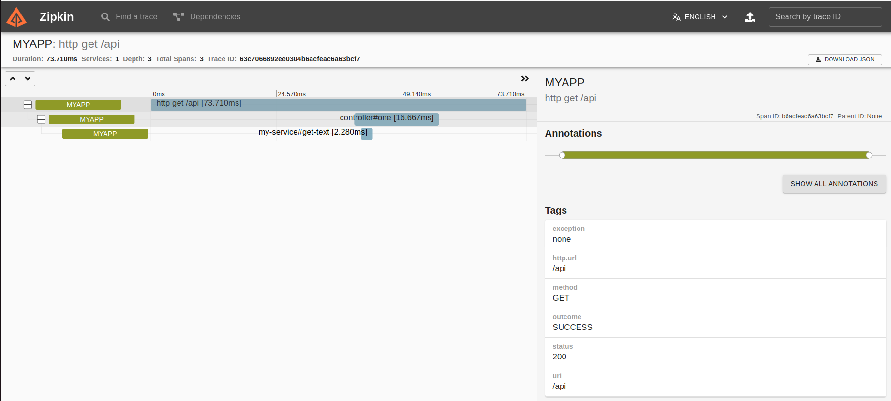

## Использование Observation API (Трассировка Micrometer) из Spring Boot 3
Стек: Spring Boot 3 (Web, Observation API(Micrometer)), Lombok, Zipkin server

### Описание
Сервер состоит из уровней Controller и Service, в каждом из которых по одному методу для реализации наблюдаемости и снятия трассировки.
К серверу добавлена реализация наблюдаемости с использование AOT ObservedAspect. Он позволяет помечать наблюдаемые места (методы/классы) с помощью аннотации @Observed

### Реализация
1. Необходимо запустить сервер zipkin для мониторинга трассировки в UI, например docker ```docker pull openzipkin/zipkin``` и указать порт для маппинга ```docker run -d -p 9411:9411 openzipkin/zipkin```. В application.properties(.yml) указать адрес и порт zipkin.
2. Для логирования трассировки, в application.properties(.yml) необходимо указать паттерн ```logging.pattern.level=%5p [${spring.application.name:},%X{traceId:-},%X{spanId:-}]```
3. Для указание частоты отправки трассировки на сервер zipkin, в application.properties(.yml) необходимо указать коэф ```management.tracing.sampling.probability=1.0``` ... тут указано что все трассировки надо отправлять на сервер zipkin. Можно указать 0.1 ... т.е. отправлять в zipkin только 10% новых трассировок. 
4. Для реализации Observation API (Micrometer tracert) создан один конфигурационный файл, для создания ObservedAspect наблюдателя и возможности последующего использования аннотации @Observed над методами и классами


